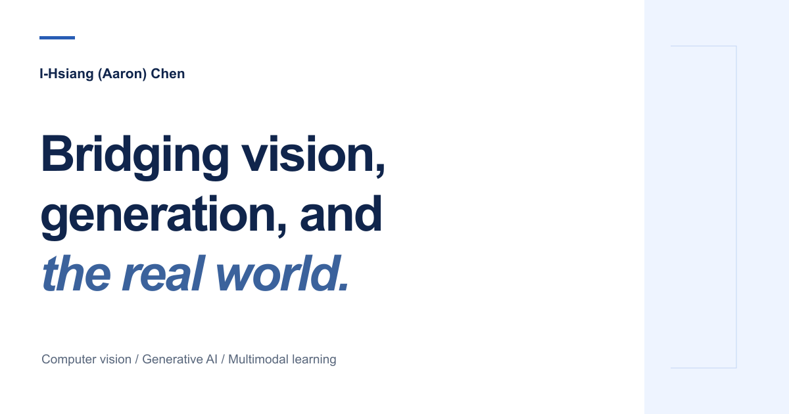
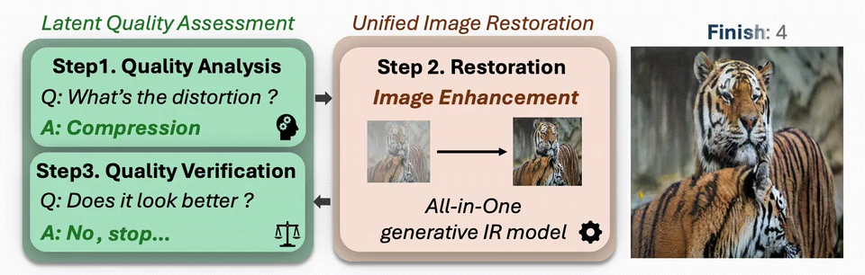
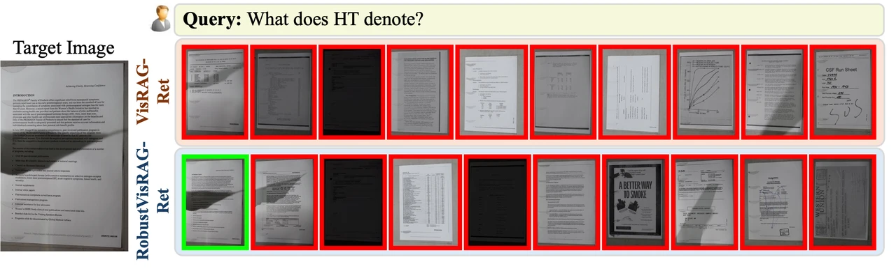
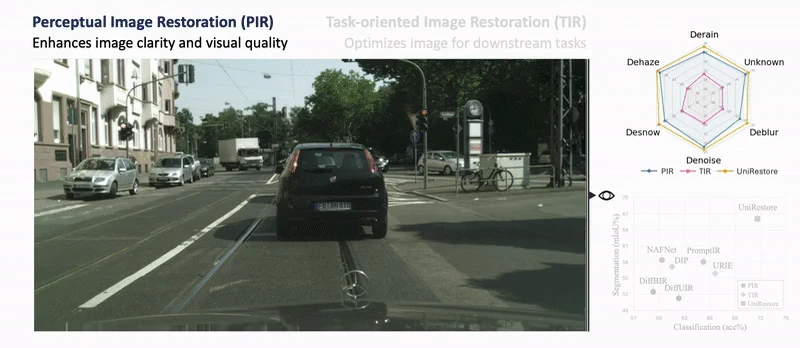
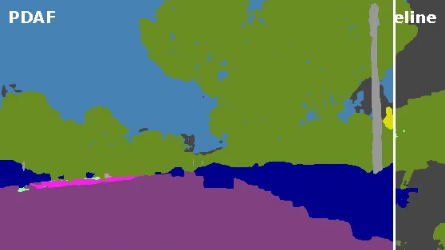
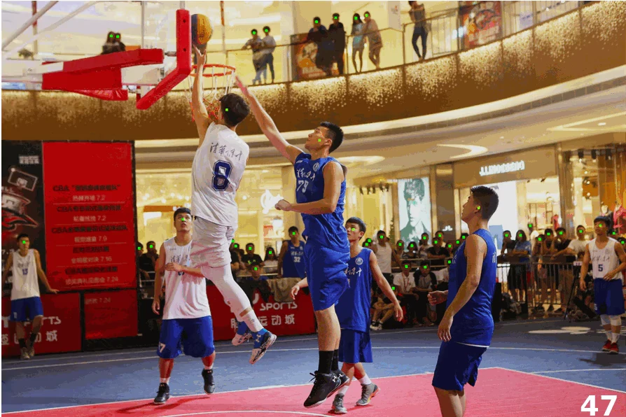

# I-Hsiang (Aaron) Chen

**Computer Vision · Generative AI · Multimodal Learning**

[Portfolio](https://aaroncih.github.io/AaronCIH/) · [Publications](https://aaroncih.github.io/AaronCIH/publications/) · [Experience](https://aaroncih.github.io/AaronCIH/experience/) · [Awards](https://aaroncih.github.io/AaronCIH/awards/) · [CV](https://aaroncih.github.io/AaronCIH/cv/)

## About me

I explore how machines perceive, restore, and understand the visual world. My research connects generative models, robust visual learning, and multimodal understanding, with a focus on systems that work beyond clean, familiar conditions.

My research background spans **National Taiwan University** and the **University of Washington**, alongside industry research experience at **Samsung Research**, **MediaTek**, and **ASML**.

## Research interests

- **Image Generation and Editing** — diffusion priors, image restoration, and task-aware visual generation.
- **Multimodal Learning** — connecting visual understanding, generation, and retrieval.
- **Domain Generalization** — learning representations that remain useful in unfamiliar environments.
- **Visual Understanding** — semantic segmentation, crowd counting, and re-identification.

## Selected research

| Preview | Project |
| --- | --- |
|  | **Restore, Assess, Repeat (RAR)** CVPR 2026 · First author  A unified framework that restores an image, assesses its quality, and repeats the process to handle unknown and composite degradations.  [Project](https://restore-assess-repeat.github.io/) · [Paper](https://arxiv.org/abs/2603.26385) · [Video](https://www.youtube.com/watch?v=vdqgE22xU2Y) |
|  | **RobustVisRAG** CVPR 2026 · First author  Causality-aware visual retrieval and grounded answer generation from documents affected by blur, noise, and other visual degradations.  [Project](https://robustvisrag.github.io/) · [Paper](https://arxiv.org/abs/2602.22013) · [Video](https://www.youtube.com/watch?v=3RFDiwW5F0A) |
|  | **UniRestore** CVPR 2025 **Highlight** · First author  Bridging perceptual quality and downstream task needs through a unified image restoration model using a diffusion prior.  [Project](https://unirestore.github.io/) · [Paper](https://arxiv.org/abs/2501.13134) · [Video](https://www.youtube.com/watch?v=Jm1NkDDXN90) |
|  | **PDAF** ICCV 2025 · First author  Probabilistic diffusion alignment and latent domain modeling for semantic segmentation beyond familiar conditions.  [Project](https://pdaf-iccv.github.io/) · [Paper](https://arxiv.org/abs/2507.21367) · [Video](https://www.youtube.com/watch?v=HQlP0R-xvfI) |
|  | **APGCC** ECCV 2024 · First author  Auxiliary Point Guidance for more stable point-based crowd counting and localization.  [Project](https://apgcc.github.io/) · [Paper](https://arxiv.org/abs/2405.10589) · [Video](https://www.youtube.com/watch?v=b_ltwfD9dLI) |

**[Explore the full research collection and animated previews →](https://aaroncih.github.io/AaronCIH/publications/)**

## Research & industry experience

| Organization | Focus |
| --- | --- |
| **University of Washington** | Visiting research on diffusion models and image enhancement |
| **National Taiwan University** | Graduate research in image enhancement, re-identification, and crowd counting |
| **Samsung Research UK** | Unified multimodal understanding and generation |
| **MediaTek** | End-to-end learning-based video compression |
| **ASML** | Synthetic data generation for defect detection |

[More about my research journey →](https://aaroncih.github.io/AaronCIH/experience/)

## Selected recognition

- **NTU Outstanding Young Award** — 2025
- **CTCI Research Award** — 2023
- **Hon-Hai Tech Award** — 2022

[All honors and awards →](https://aaroncih.github.io/AaronCIH/awards/)

## Let's connect

I'm happy to connect about research and collaboration in computer vision, generative AI, and multimodal learning.

[Email](mailto:f09921058@g.ntu.edu.tw) · [LinkedIn](https://www.linkedin.com/in/cihsiang) · [Personal website](https://aaroncih.github.io/AaronCIH/)
